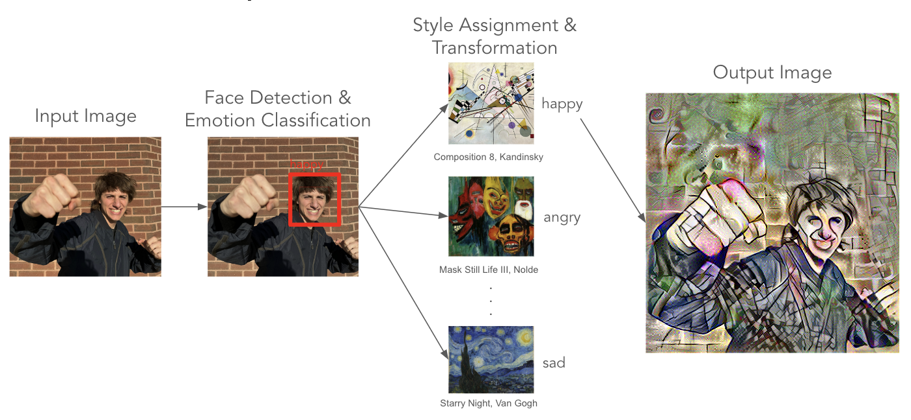

# Emotion-Driven Artistic Augmentation of Portraits

This project integrates computer vision and artistic expression to augment images by reflecting human emotions through art. It creates a pipeline that detects a face, classifies the individual’s emotion, and applies a corresponding artistic style using neural style transfer. The goal is to develop personalized artworks that visually represent the subject’s emotional state, enhancing both affective computing and digital art interaction.

## Methodology

- **Face Detection:** Utilizes MediaPipe for efficient face detection within images, ensuring the subject is ready for emotion classification.
- **Emotion Classification:** Employs Convolutional Neural Networks (CNNs) and Vision Transformers (ViTs) to identify emotions from facial expressions.
- **Style Transfer:** Applies artistic styles corresponding to detected emotions using the method developed by Gatys et al. This involves extracting and combining content and style features from images.

## Usage

The main functionality of this project is encapsulated within a the 'pipeline' Jupyter notebook, which is organized into two distinct sections for ease of use:

- **Utils Section:** This section contains all the utility functions necessary for processing the images, detecting faces, classifying emotions, and applying the neural style transfer.

- **Pipeline Section:** Here, you will find the user interface for the project, where you can directly interact with the pipeline. This section is designed to guide you through each step of the emotion detection and style transfer process, from uploading an image to viewing the stylized output.

For the best experience and to manage library versions and requirements effortlessly, it is recommended to run this notebook on Google Colab. Google Colab provides a controlled environment with consistent support for all dependencies required by this project.

## Project Inspiration

Inspired by Zach Lieberman’s work on “Más Que La Cara,” this project explores using art as a medium for emotional expression and personal interaction with the styles of world-renowned artists. It aims to personalize the artistic augmentation of images, focusing on the emotional state of individuals, which is often overlooked in traditional style transfer applications.
